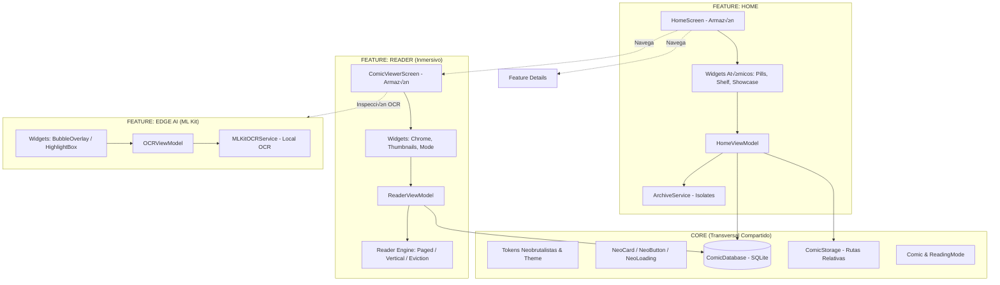

# ARQUITECTURA FEATURE-FIRST + CORE: TINTA & PAPEL

> **Estándar arquitectónico oficial para el desarrollo y mantenimiento del proyecto.**

---

## 1. Filosofía Feature-First (Empaquetado por Características)

A diferencia de la arquitectura por capas tradicional (donde todas las vistas o modelos se agrupan juntos), **Tinta & Papel** adopta una estructura **Feature-First**:
- Todo lo que pertenece a una funcionalidad (`home`, `reader`, `library`, `details`, `edge_ai`, `profile`, `shell`) se encapsula dentro de su propio directorio en `features/`.
- Cada feature implementa un patrón **MVVM pragmático y ligero**:
  - `screens/`: Armazones orquestadores principales (`Scaffold`, `SafeArea`).
  - `widgets/`: Componentes atómicos modulares (Optimización de re-renders).
  - `viewmodels/`: Gestión de estado reactivo mediante `Notifier` de Riverpod 3.
  - `services/`: Lógica de I/O, isolates o integraciones locales específicas.
- Lo verdaderamente transversal (tokens de diseño Stitch, componentes base, SQLite y modelos globales) reside en `core/`.

---

## 2. Distinción Estricta: Screens vs Widgets (Optimización de Re-renders)

Para asegurar 60 FPS estables y evitar re-renderizados innecesarios en Flutter, se establece una separación estricta:

### A. Screens (`screens/`) — El Armazón / Cajón
- **Propósito:** Actúa como la raíz estructural o contenedor de nivel superior (`Scaffold`, `SafeArea`, `AppBar`, `RefreshIndicator`).
- **Composición:** No debe contener árboles de widgets anidados de cientos de líneas. Su único trabajo es armar y ensamblar los widgets modulares de la feature.
- **Ventaja:** El Scaffold permanece inmutable mientras los widgets internos actualizan sus estados de forma independiente.

### B. Widgets (`widgets/`) — Componentes Atómicos y Scoping de Render
- **Propósito:** Elementos individuales con responsabilidad única (ej. `HomeFilterPills`, `ActiveReadingCard`, `ComicShelfItem`).
- **Constructores `const`:** Obligatorios siempre que sus propiedades lo permitan para que Flutter los omita completamente del ciclo de reconstrucción.
- **Suscripciones Granulares de Riverpod:** Los widgets deben suscribirse √∫nicamente a la propiedad del estado que les concierne mediante `.select()`:
  ```dart
  // Solo se reconstruye si cambia el filtro, sin afectar al resto de la pantalla:
  final filter = ref.watch(homeViewModelProvider.select((s) => s.activeFilter));
  ```
- **Testeabilidad:** Permite realizar **Widget Tests** y **Golden Tests** sobre componentes aislados en milisegundos, sin tener que montar toda la pantalla.

---

## 3. Gestión de Estado Oficial: `@riverpod` (Riverpod Generator)

Todo ViewModel debe implementarse usando la sintaxis moderna basada en anotaciones de código (`riverpod_annotation` y `riverpod_generator`), eliminando por completo los proveedores manuales antiguos:

```dart
import 'package:riverpod_annotation/riverpod_annotation.dart';
import '../models/home_state.dart';

part 'home_viewmodel.g.dart';

@riverpod
class HomeViewModel extends _$HomeViewModel {
  @override
  HomeState build() {
    // Auto-dispose activado por defecto para m√°xima eficiencia de memoria
    return const HomeState(isLoading: true);
  }

  Future<void> loadComics() async {
    // Lógica asíncrona inmutable
    state = state.copyWith(isLoading: false);
  }
}
```

### Ventajas Técnicas:
1. **Auto-Dispose por Defecto:** Al salir de una pantalla, Riverpod destruye y limpia el estado autom√°ticamente, liberando memoria RAM.
2. **Tipado Estricto en Compilación:** Genera código fuertemente tipado (`homeViewModelProvider`), previniendo errores de runtime.
3. **Auditoría con `riverpod_lint`:** Reglas automáticas en el IDE que advierten al desarrollador si olvida un `ref.watch` o muta el estado indebidamente.

---

## 4. Estructura de Directorios

```text
lib/
├── core/
│   ├── theme/
│   │   ├── colors.dart               # NeoColors, AppColorsLight, AppColorsDark
│   │   ├── typography.dart           # Space Grotesk, JetBrains Mono, Work Sans
│   │   └── theme.dart                # ThemeData Neobrutalista completo
│   ├── utils/
│   │   └── constants.dart            # Bordes (2px), sombras (2.5, 2.5), radios (4px)
│   ├── widgets/
│   │   ├── neo_card.dart             # Tarjeta con borde y sombra dura
│   │   ├── neo_button.dart           # Botón con efecto de depresión al tap (+2px)
│   │   └── neo_loading.dart          # Spinner de carga Neobrutalista
│   ├── database/
│   │   └── comic_database.dart       # SQLite (comics.db), migraciones e índices
│   ├── storage/
│   │   └── comic_storage.dart        # Rutas relativas seguras para iOS y Android
│   └── models/
│       ├── comic.dart                # Entidad global inmutable Comic
│       └── reading_mode.dart         # Enum ReadingMode (Manga, Cómic, Webtoon)
│
└── features/
    ├── shell/
    │   └── screens/
    │       └── main_shell_screen.dart # Armazón dock inferior Neobrutalista (4 tabs)
    │
    ├── home/
    │   ├── services/
    │   │   ├── archive_service.dart   # Isolate extraction (ZIP/RAR) y ordenamiento natural
    │   │   └── comic_info_parser.dart # Parser de ComicInfo.xml
    │   ├── viewmodels/
    │   │   └── home_viewmodel.dart    # Notifier: estantería, filtros, búsqueda, importación
    │   ├── screens/
    │   │   └── home_screen.dart       # Armazón Scaffold de la biblioteca
    │   └── widgets/
    │       ├── active_reading_card.dart # Showcase [VIÑETA ACTIVA]
    │       ├── home_filter_pills.dart   # Filtros con conteo reactivo
    │       ├── comic_shelf_item.dart    # Tarjeta tankōbon (Grid/List)
    │       ├── shelf_section.dart       # Estantería con cabecera y toggle
    │       └── comic_search_bar.dart    # Barra de búsqueda con bloque narrativo
    │
    ├── reader/
    │   ├── engine/
    │   │   ├── paged_reader.dart      # Motor horizontal (Manga D→I / Cómic I→D)
    │   │   ├── vertical_reader.dart   # Motor vertical continuo (Webtoon)
    │   │   ├── reader_page.dart       # Renderizado con ResizeImage acotado
    │   │   └── cache_eviction.dart    # Evicción activa de páginas (>4 páginas)
    │   ├── viewmodels/
    │   │   └── reader_viewmodel.dart  # Notifier: control de zoom, página y guardado DB
    │   ├── screens/
    │   │   └── comic_viewer_screen.dart # Armazón inmersivo a pantalla completa
    │   └── widgets/
    │       ├── reader_chrome.dart     # Barras de control Neobrutalistas
    │       ├── page_thumbnails_sheet.dart
    │       └── reading_mode_selector.dart
    │
    ├── library/
    │   ├── viewmodels/
    │   │   └── library_viewmodel.dart # Notifier: colecciones, sagas, autores y géneros
    │   ├── screens/
    │   │   └── collections_screen.dart # Armazón de colecciones y sagas
    │   └── widgets/
    │       ├── fanned_collection_card.dart # Portadas 3D inclinadas
    │       └── collection_details_modal.dart
    │
    ├── details/
    │   ├── screens/
    │   │   └── comic_details_screen.dart # Armazón Ficha Técnica
    │   └── widgets/
    │       ├── comic_specs_box.dart      # Cajas métricas de formato y páginas
    │       └── editorial_notes_card.dart # Callout NOTE // DETALLES EDITORIALES
    │
    ├── edge_ai/
    │   ├── services/
    │   │   └── mlkit_ocr_service.dart    # Google ML Kit: OCR local en viñetas
    │   ├── viewmodels/
    │   │   └── ocr_viewmodel.dart        # Notifier: detección y traducción de burbujas
    │   └── widgets/
    │       ├── speech_bubble_overlay.dart # Tarjeta flotante con texto extraído
    │       └── ocr_highlight_box.dart     # Bounding box Neobrutalista de viñeta
    │
    └── profile/
        ├── services/
        │   └── streak_calculator.dart    # Algoritmo de cálculo de rachas diarias
        ├── viewmodels/
        │   └── profile_viewmodel.dart    # Notifier: horas leídas, rachas e insignias
        ├── screens/
        │   └── profile_screen.dart       # Armazón de perfil, estadísticas y logros
        └── widgets/
            ├── reading_streak_card.dart  # Card destacada de racha activa (🔥 X días)
            ├── stats_summary_grid.dart   # Métricas: Horas, Tomos, Páginas
            ├── achievement_badge_item.dart # Sellos de tinta Neobrutalistas (Badges)
            └── engine_specs_card.dart    # Certificaciones de motor OOM
```

---

## 4. Diagrama de Flujo Feature-First



---

## 5. Reglas de Interacción entre Features

1. **Independencia Horizontal:** Una feature nunca debe importar widgets internos o privados de otra feature. La navegación y transferencia de entidades se realiza a través de las pantallas principales públicas (`HomeScreen`, `ComicViewerScreen`, `ComicDetailsScreen`) o los modelos de `core/models/`.
2. **Consumo de Core:** Todas las features pueden consumir `core/theme/`, `core/widgets/`, `core/database/` y `core/models/`.
3. **ViewModels Puros y Granularidad:** Cada feature tiene sus propios ViewModels (`Notifier` de Riverpod 3). Los widgets hijos deben usar `.select()` para suscribirse a cambios mínimos de estado, evitando re-renderizar el `Screen` completo.
